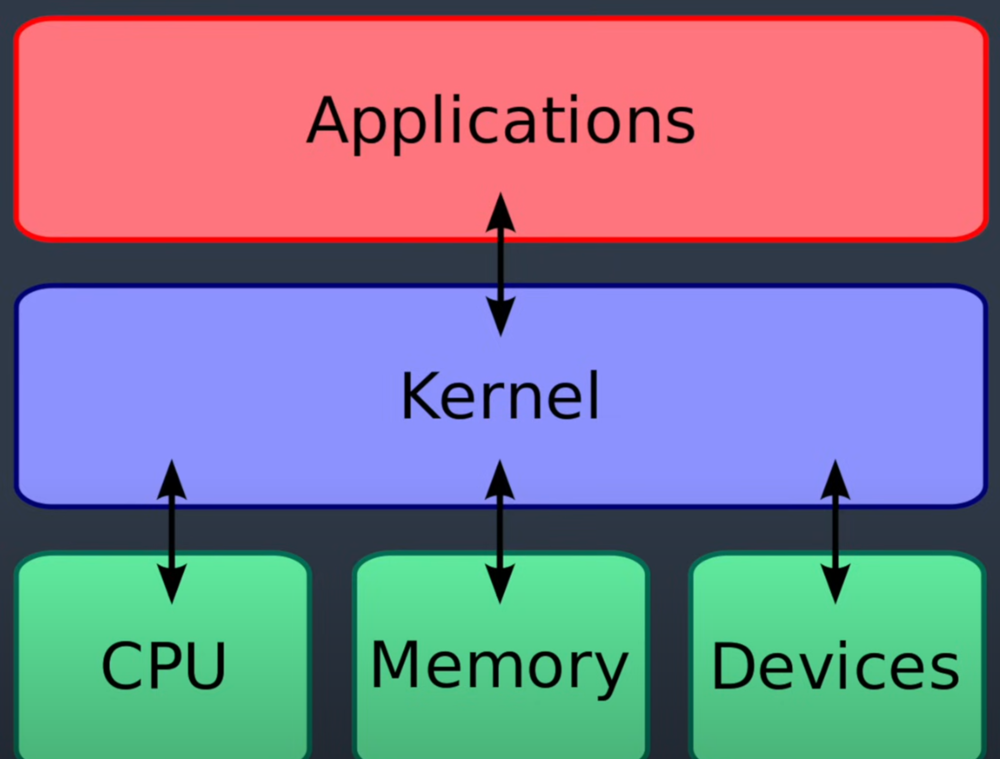
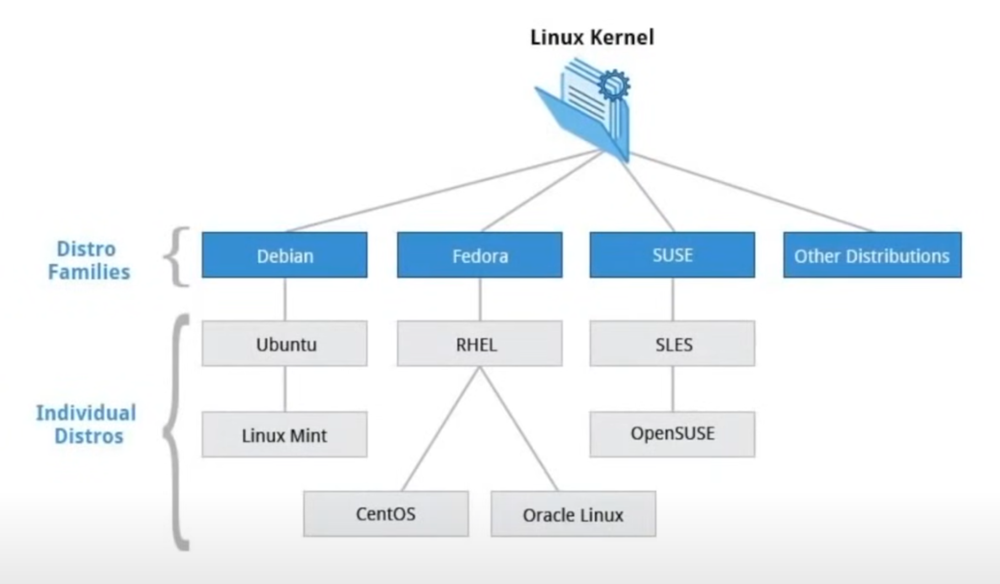
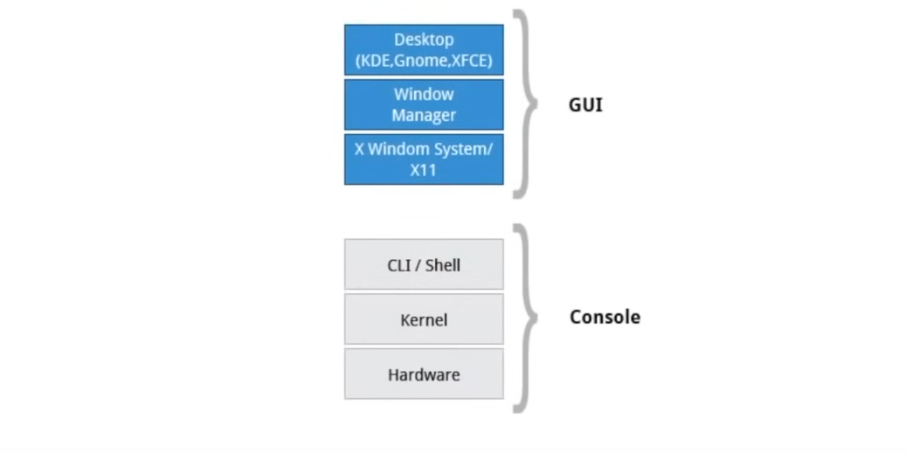

# 01 Linux Terminology and Examples

- **Kernel** - glue between hardware and applications

  - kernel.org

    

- **distribution** - collection of software making up a Linux-based OS
  

- **boot loader** - program that boots the operating system

  - GRUB
  - ISOLINUX

- **service** - program that runs as a background process

  - httpd
  - nfsd
  - ntpd
  - ftpd
  - named

- **filesystem** - method for storing and organizing files

  - ext3
  - ext4
  - FAT
  - NTFS
  - XFS
  - Btrfs

- **X Window System** - provides standard toolkit and protocol to build graphical subsystem on nearly all Linux systems

  

- **desktop environment** - Graphical User Interface on top of the operating system

  - GNOME
  - KDE
  - Xfce
  - Fluxbox

- **command line** - Interface for typing commands on top of the operating system

- **shell** - Command Line interpreter that interprets the command line input and instructs the operating system to perform any necessary tasks and commands
  - bash
  - tcsh
  - zsh
  - fish
